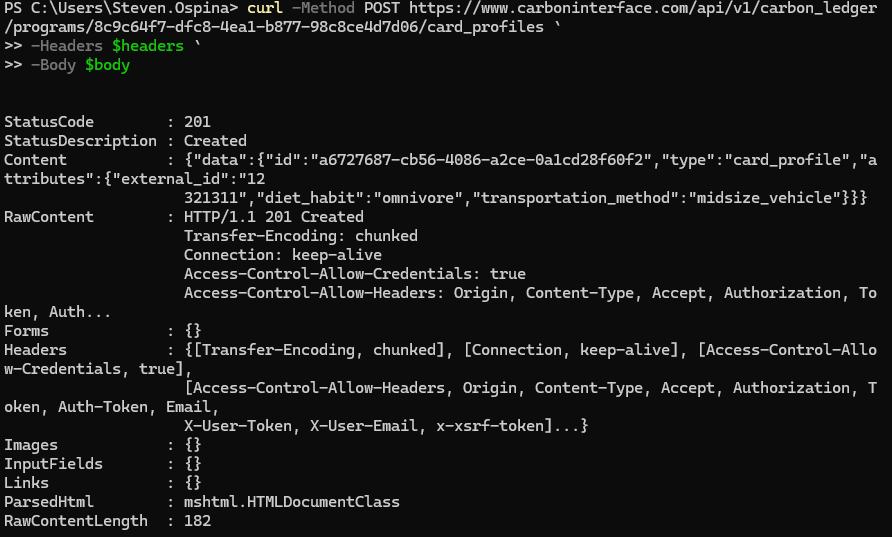
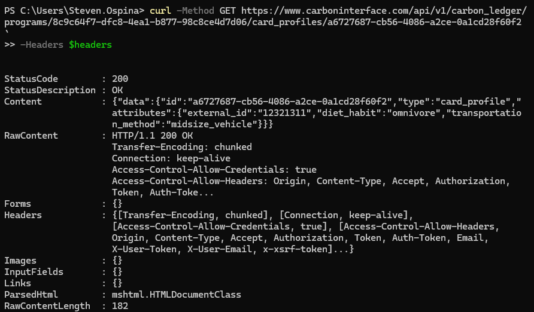
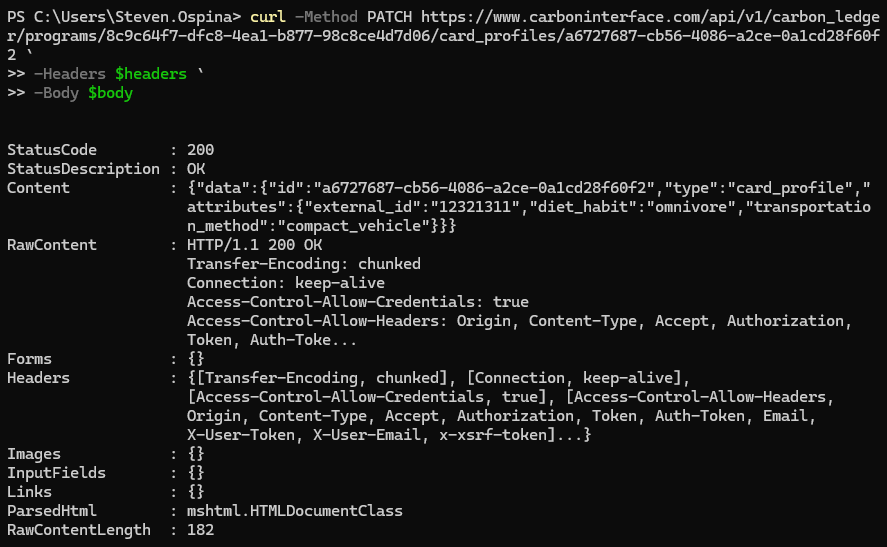
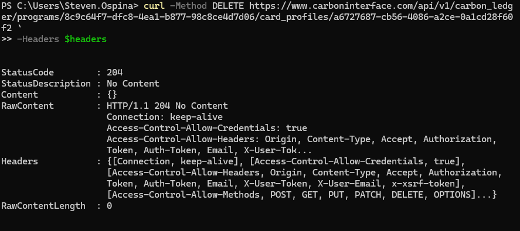
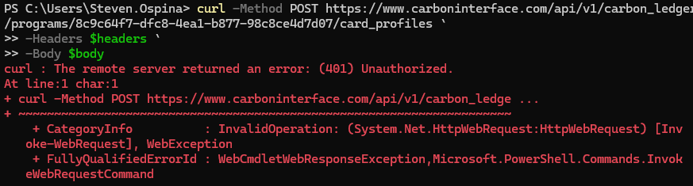
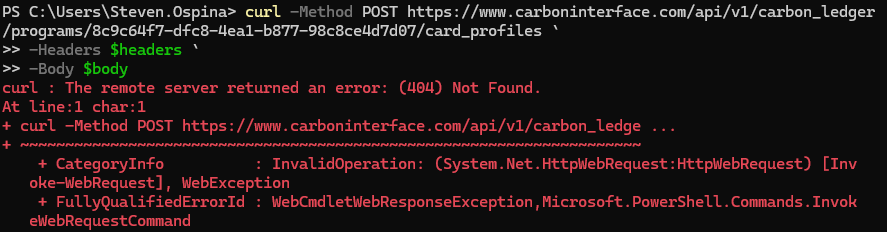
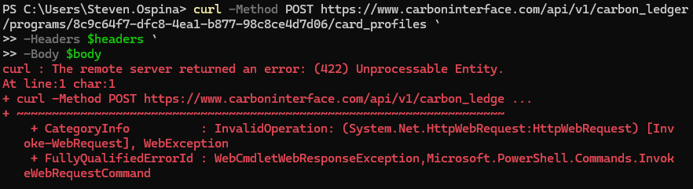

# 🌱 CRUD with cURL for the Carbon Interface API

This document walks you through performing CRUD requests (Create, Read, Update, Delete) with `curl` and [Carbon Interface API](https://docs.carboninterface.com).

---

## 🔐 Requirements

- `curl` installed.
- A valid API Key from the app. You can store the api key in a variable using:

```shell
$env:API_KEY="Your_API_KEY"
```

---

## 🆕 POST Request

📌 Endpoint Structure:
`https://www.carboninterface.com/api/v1/carbon_ledger/programs/PROGRAM_UUID/card_profiles`

📌 Body and headers Structure

```shell
$body = '{
  "external_id": "12321311",
  "diet_habit": "omnivore",
  "transportation_method": "midsize_vehicle"
}'

$headers = @{
  "Authorization" = "Bearer $env:API_KEY"
  "Content-Type"  = "application/json"
}
```

Now full command in power shell:

```shell
curl -Method POST https://www.carboninterface.com/api/v1/carbon_ledger/programs/8c9c64f7-dfc8-4ea1-b877-98c8ce4d7d06/card_profiles `
-Headers $headers `
-Body $body
```

> ℹ️ Replace `PROGRAM_UUID` unique identifier of the carbon ledger program to which the card profile will be added.

---

Example of a response:



## 📖 Get Request (Read)

📌 Endpoint Structure:
`https://www.carboninterface.com/api/v1/carbon_ledger/programs/PROGRAM_UUID/card_profiles/PROFILE_UUID`

```shell
curl -Method GET https://www.carboninterface.com/api/v1/carbon_ledger/programs/8c9c64f7-dfc8-4ea1-b877-98c8ce4d7d06/card_profiles/a6727687-cb56-4086-a2ce-0a1cd28f60f2 `
-Headers $headers
```

> ℹ️ Replace `PROGRAM_UUID` unique identifier of the carbon ledger program to which the card profile will be added.
> ℹ️ Replace `PROFILE_UUID` unique identifier withthe previous card profile id.

Example GET response:



---

## ✏️ Update Request

Carbon Interface API does not use PUT request but you can update with PATCH or even POST

📌 Endpoint Structure:
`https://www.carboninterface.com/api/v1/carbon_ledger/programs/PROGRAM_UUID/card_profiles/PROFILE_UUID`

```shell
$body = '{
  "external_id": "12321311",
  "diet_habit": "omnivore",
  "transportation_method": "compact_vehicle"
}'
```

PATCH request:

```shell
curl -Method PATCH https://www.carboninterface.com/api/v1/carbon_ledger/programs/8c9c64f7-dfc8-4ea1-b877-98c8ce4d7d06/card_profiles/a6727687-cb56-4086-a2ce-0a1cd28f60f2 `
-Headers $headers `
-Body $body
```

Example:



---

## ❌ DELETE Request

```shell
curl -Method DELETE https://www.carboninterface.com/api/v1/carbon_ledger/programs/8c9c64f7-dfc8-4ea1-b877-98c8ce4d7d06/card_profiles/a6727687-cb56-4086-a2ce-0a1cd28f60f2 `
-Headers $headers
```

Example:



---

## ❗ Negative Responses / Error Cases

Using wrong method:


Status: 401 Unauthorized -> due to a bad token



Status: 404



Status 422: Unprocessable entity



## 📚 Recursos

- [Official Carbon Interface Documentation](https://docs.carboninterface.com/#/?id=introduction)
